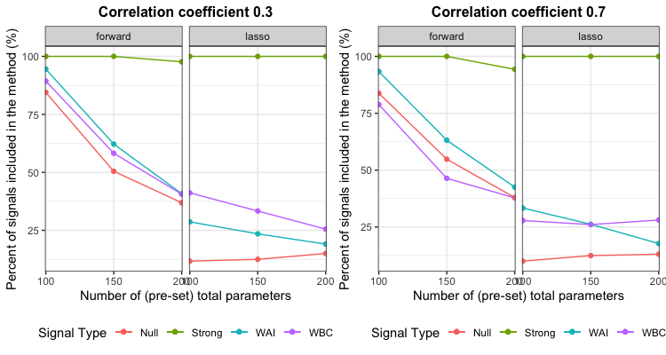

```{r setup, include=FALSE}
library(tidyverse)
library(MASS)
library(matrixcalc)
library(pracma)

library(dplyr)

library(ggplot2)

knitr::opts_chunk$set(
	echo = TRUE,
	warning = FALSE,
	fig.width = 8, 
  fig.height = 6,
  out.width = "90%"
)

options(
  ggplot2.continuous.colour = "viridis",
  ggplot2.continuous.fill = "viridis"
)

scale_colour_discrete = scale_colour_viridis_d
scale_fill_discrete = scale_fill_viridis_d

theme_set(theme_minimal() + theme(legend.position = "bottom"))
```

# Introduction

Variables  selection methods are always trying to balance between model fitness and model complexity in the high-dimensional setting. And in application of traditional variables selection methods, they often struggle with identifying weak signals. Some signals are weak but they are still of importance to the true model.


# Objectives

In this project, we use simulations to compare two automated methods of variable selection, namely stepwise forward method and LASSO regression, in their ability to correctly identify relevant signals and estimating how missing weak signals impact coefficients of strong signals. Specifically, we aim to assess:  
(1) How well each method performs in identifying weak and strong predictors (by calculating the percentages of strong and weak predictors being captured by each model), and  
(2) How missing “weak” predictors impact the estimations of strong predictors (by calculating the bias and MSE between “true” strong coefficients and their estimates).


# Statistical methods to be studied

Methods of interest in this report are the step-wise forward method and automated LASSO regression which are two popular methods for the variable selection.

\begin{description}
\item[Step-wise forward method:] Starting with the empty model, and iteratively adds the variables that best improves the model fit. In this report, it is done by sequentially adding predictors with the largest reduction in AIC, where
$$AIC = n\ln(\sum_{i=1}^n (y_i - \widehat{y}_i)^2/n) + 2p,$$ where $\widehat{y}_i$ is the fitted values from a model, and $p$ is the dimension of the model (i.e.,number of predictors plus 1).


\item[Automated LASSO regression] It estimates the model parameters by optimizing a penalized loss function:
$$\min_\beta \frac{1}{2n} \sum_{i=1}^n (y_i - x_i \beta )^2 + \lambda \lVert \sum_{k=1}^p|\beta_k|$$
where $\lambda$ is a tunning parameter. Here cross-validation (CV) is the chosen selection criteria for LASSO.
\end{description} 


# Scenarios to be investigated

First we give the definitions of "strong", "weak-but-correlated” and “weak-andindependent” signals.  

Definition of strong signals --- 
$$S_1=\{j:|\beta_j|>c\sqrt{log (p) / n},\mbox{ some } c>0,  1\le j \le p\}$$
Definition of weak-but-correlated signals  ---
$$S_2=\{j: 0<|\beta_j|\le c\sqrt{log (p) / n},\mbox{ some } c>0, \mbox{corr}(X_j, X_j')\ne 0, \mbox{for some } j'\in S_1,  1\le j \le p\}$$
Definition of weak-and-independent signals  ---
$$S_3=\{j: 0<|\beta_j|\le c\sqrt{log (p) / n},\mbox{ some } c>0, \mbox{corr}(X_j, X_j')= 0, \mbox{for all } j'\in S_1,  1\le j \le p\}$$

To narrow the scope of our simulations, some variables are fixed.  
  (1) We set the proportions of strong signals, weak and independent signals, and weak but correlated signals to be 10%, 20%, 20% respectively, then we have 50% null predictors.  
  (2) The coefficients of strong signals follow Uniform(5, 10) which is sufficiently larger than the bound, and the coefficients of strong signals follow Uniform(1/2bound, bound), where the bound is threshold by definition.  
  (3) The threshold multiplier c is set to be 1.

## Task 1

* Case 1: we let the number of parameters vary from 10 to 100, with step size of 10 (low-dimension to high-dimension while still satisfying our n>p condition). In addition, we varied the correlation between the strong predictors and WBC predictors at 0.3, 0.5, and 0.7. The sample size is fixed at 200.

* Case 2: we inspected both methods’ performances by letting the number of parameters larger than sample size. We let p vary at 100, 150, and 200, and the correlation between strong predictors and WBC predictors be 0.3 and 0.7. Our sample size is fixed at 90.

## Task 2

Here, we fixed the sample size at 100, the total number of parameters at 50. Our correlation coefficient is set to be 0.3.
 

# Methods for generating data

## Generating the predictor data matrix X

From the proportions of each type of signals and the number of total predictors, we get how many signals for each type. Then we generate a covariance matrix with the correlations set in this scenario following the definitions of each signal type. Whether the matrix is positive definite is also checked before passing it to the R function `mvrnorm`, which produces random numbers from a multivariate normal distribution. 

## Generating the response Y

We generate the response Y as a linear combination of four types of signals and an error term. The distribution of Y is  
$$Y\sim N(\boldsymbol X\boldsymbol \beta, \sigma^2)$$  
where the variance is 1.


# Performance Measures

## Task 1: identify strong and weak predictors

We wanted to investigate both variable selection methods’ ability to correctly identify strong and weak (both WAI and WBC) predictors and whether they do so consistently. Therefore, we measure their performances by calculating the percentages of captured strong, WBC and WAI predictors using these two methods as the number of parameters and correlation value changes.

## Task 2; how missing “weak” predictors impacts the estimations of strong predictor

In order to see the effect of missing weak predictors on the coefficient estimates of strong predictors, before fitting the models, we deleted a certain number of weak signals (from 1 to 20) from the original data. We then calculated the MSE and bias between “true” strong coefficients and their estimates, where  

* bias

$$\frac{1}{p_{strong}}\sum_{j=1}^{p_{strong}}(\hat{\boldsymbol\beta_j}-\boldsymbol\beta_j)$$

* MSE

$$\frac{1}{p_{strong}}\sum_{j=1}^{p_{strong}}(\hat{\boldsymbol\beta_j}-\boldsymbol\beta_j)^2$$


# Simulation results and discussion

## Task 1

### Case 1

Both methods captured 100% of the strong predictors and the least percentage of null signals in all simulations. Adjusting for correlation, as the number of parameters increased, the proportion of captured weak predictors also increased.

We observed that LASSO’s ability to capture weak signals is more sensitive to the number of parameters than stepwise forward. We also observed that stepwise forward selected a higher proportion of WAI signals compared to WBC signals for low-medium correlations (0.3 and 0.5), while the LASSO selected more WBC signals. However, when there is high correlation (0.7), both methods’ abilities to capture WBC signals significantly decreased (Figure 1). This is a reasonable result, since WBC are highly correlated with strong signals; thus, once strong signals have been selected, less information is contained in WBC signals, making them less likely to be picked. In contrast, the proportion of WAI signals correctly captured was insensitive to an increase in correlation (Figure 1). This is due to the fact that WAI signals are independent of correlations.


### Case 2

We observed that stepwise forward performed less well in selecting strong signals when dimensionality is high (specifically when p>>n). In fact, the procedure almost always selected 90 parameters, which is also the sample size, while the LASSO gives a sparser solution (Figure 2). Meanwhile, the LASSO picked 100% of the strong signals (Figure 3), but given highly correlated variables, LASSO tends to pick a few of them and shrinks the rest to zero (Zou and Hastie, 2005). This explains why when correlation was 0.7, the LASSO correctly captured a lower percentage of WBC variables than stepwise forward, and compared to when correlation was 0.3 (Figure 3).

Overall, for low-to-medium dimensional data, forward selection tends to perform well and more consistently, but the LASSO outperforms forward selection in capturing relevant strong signals and gives a sparse solution in high-dimensional settings.

## Task 2

In general, stepwise performs better in estimating the coefficients of strong signals (Figure 4). Since we removed the WBC signals first, the observed effect of missing the first 10 signals on the strong signals’ MSE was caused by removal of WBC signals. We noticed that as the number of missing WBC signals increased, both the MSE and bias magnitude of strong signals went up (Figure 4 and 5). Furthermore, removing WAI signals (signals 11 to 20) did not have any significant effect on the MSE or bias magnitude of strong signals (Figure 4 and 5). However, overall, stepwise forward seemed to perform better in estimating the coefficients of strong signals in our scenario. We hypothesize that since the LASSO (performing regularization) reduces dimensionality of the data, and the coefficients are estimated in a lower dimensional data, this may cause a high bias/MSE error. In addition, given certain specifications of correlations between predictors, and high SNR values (which applies to our setting), the LASSO estimators could introduce bias and inaccuracy compared to forward stepwise selection (Hastie et al. 2017).

Overall, stepwise forward does a better job at estimating strong signals’ coefficients  in this scenario.


# References

1. Hastie T., Tibshirani R., Tibshirani R. J. 2017. Extended comparisons of best subset selection, forward stepwise selection, and the lasso. arXiv preprint arXiv: 1707.08692

2. Zou H., Hastie, T. 2005. Regularization and Variable Selection via the Elastic Net. Journal of the Royal Statistical Society. Series B (Statistical Methodology). 67(2): 301-320.


# Code

The gitbub link is https://github.com/qi-yuchen/Advancd_Computing_Project_1.


```{r echo=FALSE, out.width='100%', fig.cap="Percent of each predictor type detected"}
knitr::include_graphics('F1.png')
```

```{r echo=FALSE, out.width='100%', fig.cap="Number of parameters captured"}

```

```{r echo=FALSE, out.width='100%', fig.cap="Percent of signals detected"}

```

```{r echo=FALSE, out.width='100%', fig.cap="Bias"}

```

```{r echo=FALSE, out.width='100%', fig.cap="MSE"}

```


