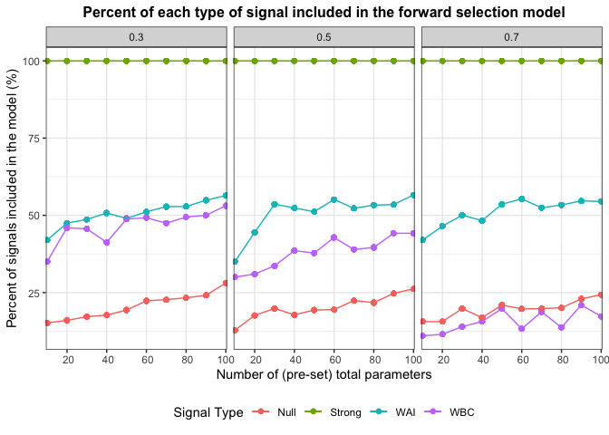
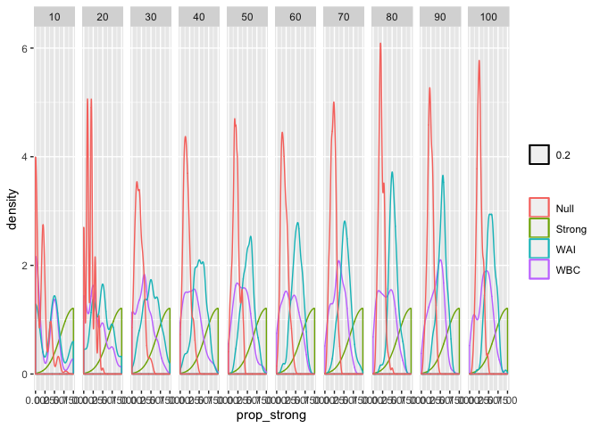

data\_testing
================
Ngoc Duong - nqd2000
2/8/2020

    ## ── Attaching packages ─────────────────────────────────────────────────────────────────────────────────────────── tidyverse 1.2.1 ──

    ## ✔ ggplot2 3.2.1     ✔ purrr   0.3.3
    ## ✔ tibble  2.1.3     ✔ dplyr   0.8.3
    ## ✔ tidyr   1.0.0     ✔ stringr 1.4.0
    ## ✔ readr   1.3.1     ✔ forcats 0.4.0

    ## ── Conflicts ────────────────────────────────────────────────────────────────────────────────────────────── tidyverse_conflicts() ──
    ## ✖ dplyr::filter() masks stats::filter()
    ## ✖ dplyr::lag()    masks stats::lag()

    ## 
    ## Attaching package: 'MASS'

    ## The following object is masked from 'package:dplyr':
    ## 
    ##     select

    ## 
    ## Attaching package: 'pracma'

    ## The following object is masked from 'package:purrr':
    ## 
    ##     cross

Write function to simulate dataset with 3 kinds of given predictors +
null predictors

``` r
sim_beta_strong = function(n_strong, coef_strong){
  rep(coef_strong, n_strong) + runif(n_strong, min = 0, max = coef_strong)
}


sim_data = function(n_sample = 200, n_parameter = 50, prop_strong = 0.1, prop_wbc = 0.2, prop_wai = 0.2, c = 1, cor = 0.3, coef_strong = 5) {
  # Numbers of four signals
  n_strong = as.integer(n_parameter * prop_strong) # strong
  n_wbc = as.integer(n_parameter * prop_wbc) # weak but correlated
  n_wai = as.integer(n_parameter * prop_wai) # weak and independent
  n_null = n_parameter - n_strong - n_wbc - n_wai # null
  
  if (n_null < 0) {
    return("Given parameters' proportions are not valid.")
  }
  
  bound = c * sqrt(log(n_parameter) / n_sample) # threshold of weak/strong, the default is 0.14
  if (coef_strong < bound) {
    coef_strong = coef_strong + 2 * bound
  }
  
  cor_matrix = diag(n_parameter)
  
  # add correlation
  for (i in 1:n_strong) {
    cor_matrix[i, (n_strong + n_wai + i)] = cor
    cor_matrix[i, (n_strong + n_wai + n_wbc + 1 - i)] = cor
    cor_matrix[(n_strong + n_wai + i), i] = cor
    cor_matrix[(n_strong + n_wai + n_wbc + 1 - i), i] = cor
  }
  
  
  if (!is.positive.definite(cor_matrix)) {
    return("The correlation matrix is not valid.")
  }
  
  # simulate the data from multivariate normal
  X = mvrnorm(n = n_sample, mu = rep(0, n_parameter), Sigma = cor_matrix) # var = 1, correlation = covariance
  
  beta = c(
    sim_beta_strong(n_strong, coef_strong),
    runif(min = bound/2, max = bound, n = n_wai), 
    runif(min = bound/2, max = bound, n = n_wbc),
    rep(0, n_null) 
  )
  
  Y = 1 + X %*% beta + rnorm(n_sample)
  data = as_tibble(data.frame(cbind(X, Y)))
  
  # Name the columns
  cols = c(
    str_c("strong", 1:n_strong, sep = "_"),
    str_c("wai", 1:n_wai, sep = "_"),
    str_c("wbc", 1:n_wbc, sep = "_"),
    str_c("null", 1:n_null, sep = "_"),
    "Y"
   )
   colnames(data) = cols
   data = data %>% 
     dplyr::select(Y, everything())
   
  masterlist = list(beta = beta, 
       correlation = cor,
       n_parameter = n_parameter,
       prop_strong = prop_strong,
       prop_wbc = prop_wbc, 
       prop_wai = prop_wbc,
       n_strong = n_strong,
       n_wai = n_wai,
       n_wbc = n_wbc,
       data = data
       )
}
```

Function implementing forward selection method using AIC as criterion

``` r
forward.aic.lm = function(df) {
  null.lm = lm(Y ~ 1, data = df)
  full.lm = lm(Y ~ ., data = df)
  aic.lm = step(object = null.lm,
             scope = list(lower = null.lm, 
                          upper = full.lm), 
             direction = "forward",
             trace = FALSE, 
             k = 2)
  aic.lm
}
```

Write function to calculate: 1) how many (percent of) strong predictors
are selected by model 2) how many (percent of) wbi and wac predictors
are missed my the model

``` r
predictors.analysis = function(model_coeff, n_parameter,
                               prop_strong = 0.1, prop_wbc = 0.2, prop_wai = 0.2) {
  
  n_strong = as.integer(n_parameter * prop_strong) # strong
  n_wbc = as.integer(n_parameter * prop_wbc) # weak but correlated
  n_wai = as.integer(n_parameter * prop_wai) # weak and independent
  n_null = n_parameter - n_strong - n_wbc - n_wai # number of null
  model_coeff = names(model_coeff)
  return(tibble(
    n_parameter_total = n_parameter,
    n_parameter_selected = length(model_coeff)-1,
    n_strong_selected = length(which(str_detect(model_coeff, "strong"))),
    n_wai_selected = length(which(str_detect(model_coeff, "wai"))),
    n_wbc_selected = length(which(str_detect(model_coeff, "wbc"))),
    n_null_selected =  n_parameter_selected - n_strong_selected - n_wai_selected - n_wbc_selected,
    prop_strong =  round(n_strong_selected/n_strong,2),
    prop_wai = round(n_wai_selected/n_wai,2),
    prop_wbc = round(n_wbc_selected/n_wbc,2),
    cor = c,
    prop_null = round(n_null_selected/n_null,2)
  ))
}
```

Scenario 1: while changing number of parameters, simulate the data 100
times for each parameter

``` r
#key parameters
set.seed(77)
forward_summary = NULL
n_parameter = c(10,20,30,40,50,60,70,80,90,100)
n_sim = 50
n_sample = 200
cor = c(0.3, 0.5, 0.7)

set.seed(77)
for(c in cor){
for(i in n_parameter){
    for (j in 1:n_sim) {
      df = sim_data(n_parameter = i, n_sample = n_sample, cor = c)
      
    # create the forward model
      forward_lm = forward.aic.lm(df$data)
      
    # calculate the percentages of coefficients missed
      forward_data = predictors.analysis(model_coeff = forward_lm$coefficients, 
                                         n_parameter = i)
      # Gather created models for diagnostics
      forward_summary = rbind(forward_summary, forward_data)
    }
}}
```

``` r
forward_summary_final = forward_summary %>% 
  group_by(n_parameter_total, cor) %>% 
  mutate(strong_prfm = mean(prop_strong),
         wai_prfm = mean(prop_wai),
         wbc_prfm = mean(prop_wbc), 
         null_prfm = mean(prop_null))
```

Visualization with all simulations: 1) How many percent of variables are
selected by method, on average?

``` r
forward_summary_final %>%  ggplot(aes(x = n_parameter_total))+
 geom_point(aes(y=strong_prfm*100, color="prop_strong")) +
 geom_point(aes(y=wai_prfm*100, color="prop_wai")) + 
 geom_point(aes(y=wbc_prfm*100, color="prop_wbc")) + 
 geom_point(aes(y=null_prfm*100, color="prop_null")) + 
  geom_line(aes(y=strong_prfm*100, color="prop_strong")) +
  geom_line(aes(y=wai_prfm*100, color="prop_wai")) + 
  geom_line(aes(y=wbc_prfm*100, color="prop_wbc")) + 
  geom_line(aes(y=null_prfm*100, color="prop_null")) + 
 labs(title = "Percent of each type of signal included in the forward selection model",
       y = "Percent of signals included in the model (%)",
       x = "Number of (pre-set) total parameters") +  
  theme_bw() + 
  theme(plot.title = 
          element_text(hjust = 0.5, 
                       size=12, 
                       face='bold'), 
          legend.position = "bottom") +
  scale_x_discrete(limits=c(20,40,60,80,100)) + 
  scale_color_discrete(name = "Signal Type", labels = c("Null", "Strong", "WAI", "WBC")) +
  facet_grid(~cor, scales="free", space="free")
```

<!-- -->

``` r
#represent the same type of info using different visualization (but does not require taking mean)
forward_summary_final %>% ggplot(aes()) +
geom_density(aes(x = prop_strong, color = "Strong", alpha = 0.20)) +
geom_density(aes(x = prop_wbc, color = "WBC", alpha = 0.20)) + 
geom_density(aes(x=prop_wai, color = "WAI", alpha=0.20)) +
geom_density(aes(x=prop_null, color = "Null", alpha=0.20)) +
  facet_grid(~n_parameter_total) +
    theme(legend.title=element_blank())
```

<!-- -->
